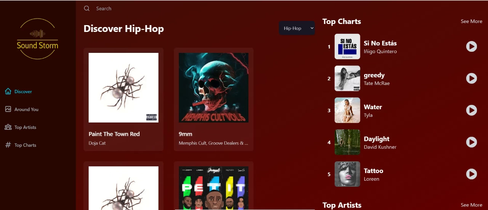
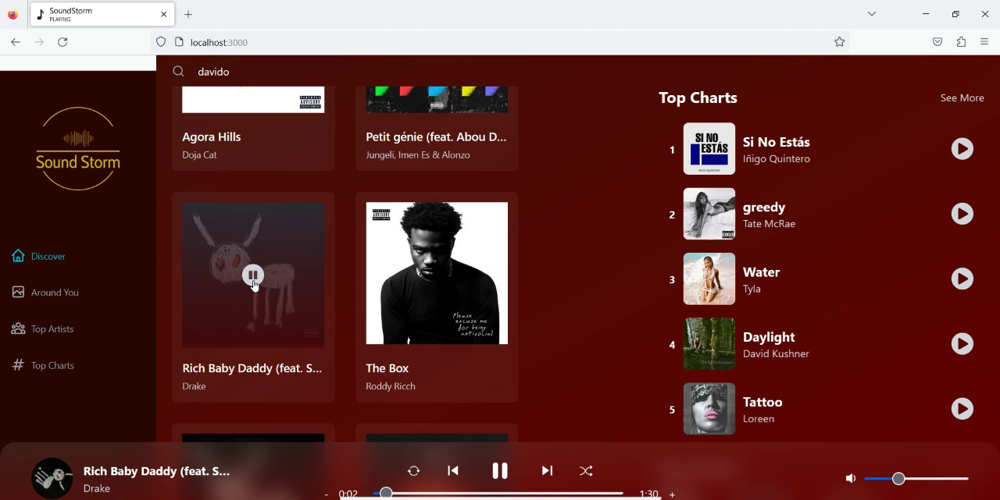
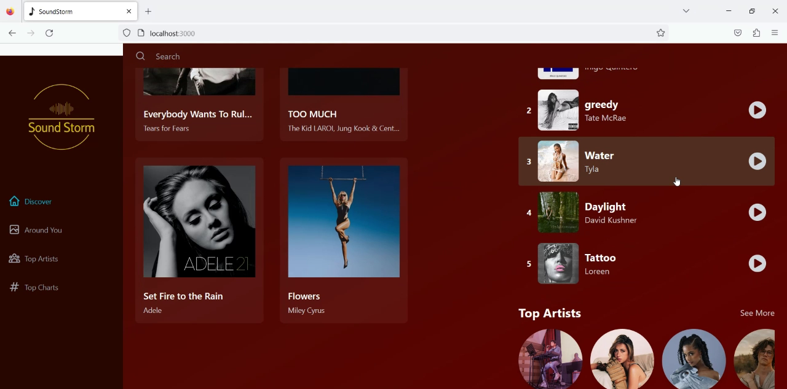
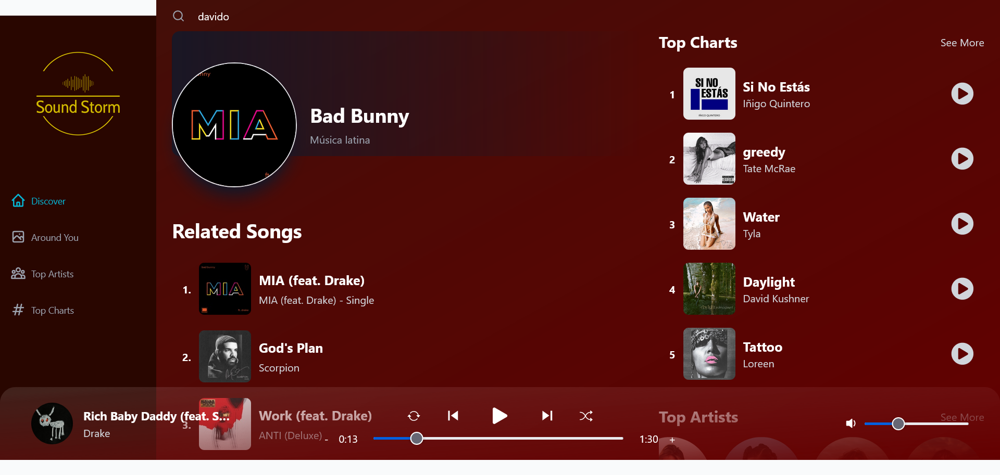
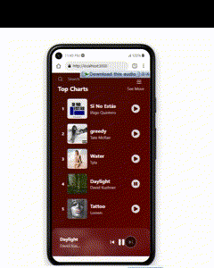
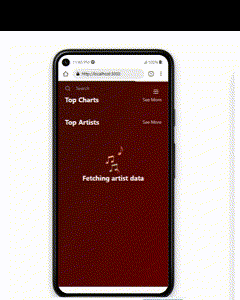

# Portfolio Project - Spotify clone music app(Sound Storm)

## Table of contents

- [Portfolio Project - Spotify clone music app(Sound Storm)](#portfolio-project---spotify-clone-music-appsound-storm)
  - [Table of contents](#table-of-contents)
  - [Overview](#overview)
    - [App Features](#app-features)
    - [Screenshots](#screenshots)
      - [Desktop](#desktop)
      - [Mobile](#mobile)
    - [Links](#links)
    - [Built with](#built-with)
    - [Continued development](#continued-development)
  - [Author](#author)
  - [Acknowledgments](#acknowledgments)

## Overview

### App Features

- __Music Player__ - Users can play any song with in-built music player including basic controls such as the previous song, the next song, and pause/play buttons and details like the song’s name, artist, volume, repeat, shuffle and duration controls.
- __Discover Page__ - Users can  choose a genere and get the tops songs for that genre
- __Around you page__ - Users are able to get top local songs based on their geolocation information.
- __Artists Page__ - Users can view a list of the top artists for a genre
- __Artist Details Page__ - Users can view additional info that is, artist other rleases, related tracks and more !
- __Song Details Page__ -  Users can view the lyrics of song and a list of similar songs, artist, genre and other related info.
- __Search Functionality__ - Users can search artists or songs , and get  results based on their queries.

### Screenshots

#### Desktop

#### Mobile

### Links

- Solution URL: [Repo](https://github.com/Gandah/spotify-clone-music-app.git)
- Live Site URL: [Visit Site](#)

### Built with

- [APIs](#APIs)
  - [Shazam API](https://rapidapi.com/tipsters/api/shazam-core/) - to fetch music data
  - [IP Geolocation API](https://geo.ipify.org/) - to get user's location
- Redux Toolkit
- Swiper.js - for fluid user interations
- Mobile-first workflow
- [React](https://reactjs.org/) - JS library
- [Tailwind Css](https://tailwindcss.com/) - Css framework
- React icons

### Continued development

- Improve user interface
- Add extra functionalities

## Author

- Website - [MyLinkedIn](https://www.linkedin.com/in/gandahkelvin)
- Frontend Mentor - [@Gandah](https://www.frontendmentor.io/profile/Gandah)
- Twitter - [@mr_g4nderson](https://twitter.com/mr_g4nderson?t=A5NobjZab2sVEdh3Zq9s0A&s=09)

## Acknowledgments
@JavaScript Mastery 
